# Metadarkmatter Architecture

This document provides visual diagrams of the metadarkmatter system architecture, data flow, and component relationships.

## System Overview

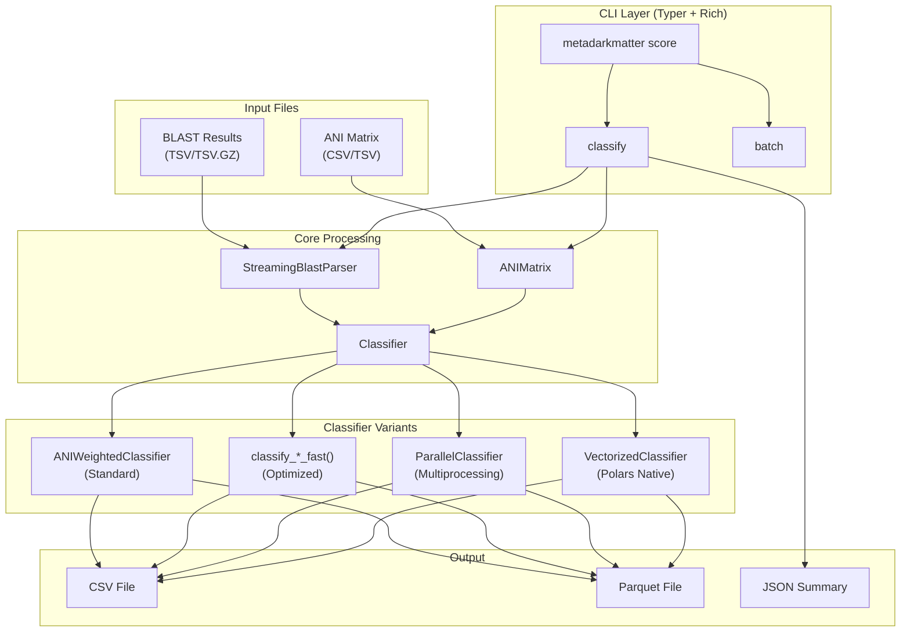
```mermaid
flowchart TB
    subgraph Inputs["Input Files"]
        BLAST["BLAST Results<br/>(TSV/TSV.GZ)"]
        ANI["ANI Matrix<br/>(CSV/TSV)"]
    end

    subgraph CLI["CLI Layer (Typer + Rich)"]
        CMD["metadarkmatter score"]
        CLASSIFY["classify"]
        BATCH["batch"]
    end

    subgraph Core["Core Processing"]
        PARSER["StreamingBlastParser"]
        ANIMAT["ANIMatrix"]
        CLASS["Classifier"]
    end

    subgraph Classifiers["Classifier Variants"]
        STD["ANIWeightedClassifier<br/>(Standard)"]
        FAST["classify_*_fast()<br/>(Optimized)"]
        PAR["ParallelClassifier<br/>(Multiprocessing)"]
        VEC["VectorizedClassifier<br/>(Polars Native)"]
    end

    subgraph Output["Output"]
        CSV["CSV File"]
        PARQUET["Parquet File"]
        SUMMARY["JSON Summary"]
    end

    BLAST --> PARSER
    ANI --> ANIMAT

    CMD --> CLASSIFY
    CMD --> BATCH

    CLASSIFY --> PARSER
    CLASSIFY --> ANIMAT

    PARSER --> CLASS
    ANIMAT --> CLASS

    CLASS --> STD
    CLASS --> FAST
    CLASS --> PAR
    CLASS --> VEC

    STD --> CSV
    FAST --> CSV
    PAR --> CSV
    VEC --> CSV

    STD --> PARQUET
    FAST --> PARQUET
    PAR --> PARQUET
    VEC --> PARQUET

    CLASSIFY --> SUMMARY
```

## Package Structure

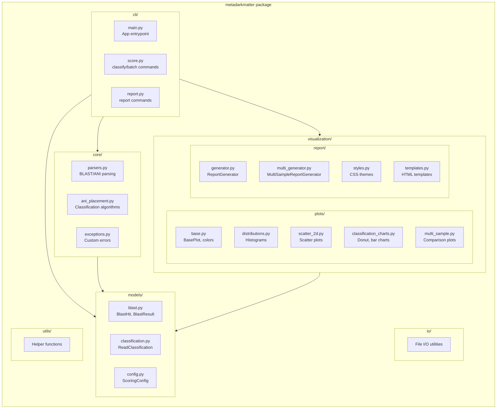
```mermaid
flowchart LR
    subgraph metadarkmatter["metadarkmatter package"]
        direction TB

        subgraph cli["cli/"]
            main["main.py<br/>App entrypoint"]
            score["score.py<br/>classify/batch commands"]
            report_cli["report.py<br/>report commands"]
        end

        subgraph core["core/"]
            parsers["parsers.py<br/>BLAST/ANI parsing"]
            ani_placement["ani_placement.py<br/>Classification algorithms"]
            exceptions["exceptions.py<br/>Custom errors"]
        end

        subgraph models["models/"]
            blast["blast.py<br/>BlastHit, BlastResult"]
            classification["classification.py<br/>ReadClassification"]
            config["config.py<br/>ScoringConfig"]
        end

        subgraph visualization["visualization/"]
            subgraph plots["plots/"]
                base["base.py<br/>BasePlot, colors"]
                distributions["distributions.py<br/>Histograms"]
                scatter["scatter_2d.py<br/>Scatter plots"]
                charts["classification_charts.py<br/>Donut, bar charts"]
                multi["multi_sample.py<br/>Comparison plots"]
            end
            subgraph report["report/"]
                generator["generator.py<br/>ReportGenerator"]
                multi_gen["multi_generator.py<br/>MultiSampleReportGenerator"]
                styles["styles.py<br/>CSS themes"]
                templates["templates.py<br/>HTML templates"]
            end
        end

        subgraph io["io/"]
            io_init["File I/O utilities"]
        end

        subgraph utils["utils/"]
            utils_init["Helper functions"]
        end
    end

    cli --> core
    cli --> models
    cli --> visualization
    core --> models
    visualization --> models
```

## Classification Algorithm

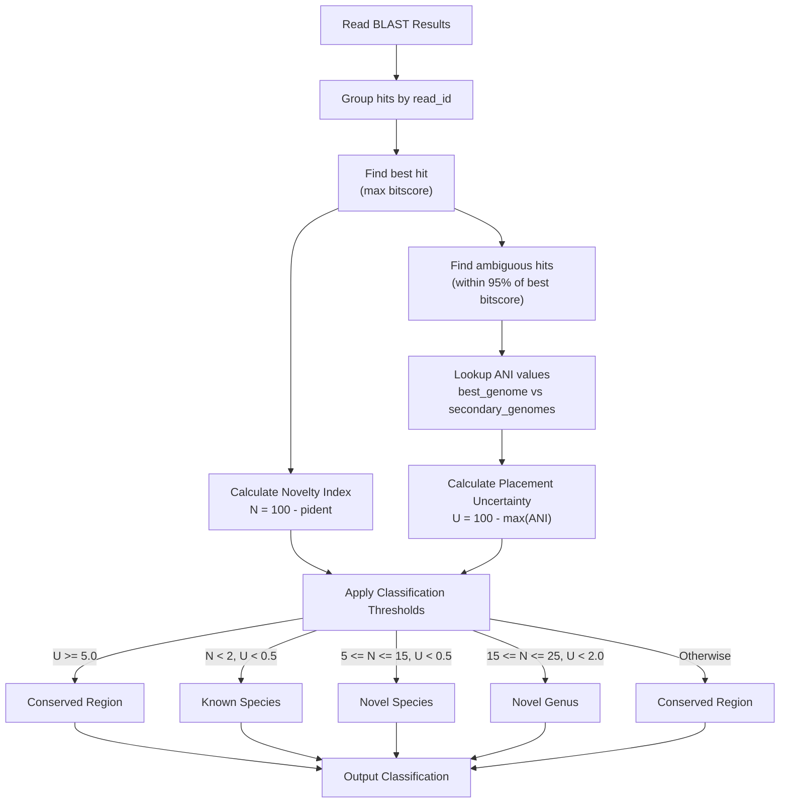
```mermaid
flowchart TD
    START["Read BLAST Results"]

    START --> GROUP["Group hits by read_id"]
    GROUP --> BEST["Find best hit<br/>(max bitscore)"]

    BEST --> N["Calculate Novelty Index<br/>N = 100 - pident"]
    BEST --> AMB["Find ambiguous hits<br/>(within 95% of best bitscore)"]

    AMB --> ANI["Lookup ANI values<br/>best_genome vs secondary_genomes"]
    ANI --> U["Calculate Placement Uncertainty<br/>U = 100 - max(ANI)"]

    N --> THRESHOLD["Apply Classification Thresholds"]
    U --> THRESHOLD

    THRESHOLD --> |"U >= 5.0"| CONSERVED["Conserved Region"]
    THRESHOLD --> |"N < 2, U < 0.5"| KNOWN["Known Species"]
    THRESHOLD --> |"5 <= N <= 15, U < 0.5"| NOVEL_SP["Novel Species"]
    THRESHOLD --> |"15 <= N <= 25, U < 2.0"| NOVEL_GEN["Novel Genus"]
    THRESHOLD --> |"Otherwise"| CONSERVED2["Conserved Region"]

    CONSERVED --> OUTPUT["Output Classification"]
    KNOWN --> OUTPUT
    NOVEL_SP --> OUTPUT
    NOVEL_GEN --> OUTPUT
    CONSERVED2 --> OUTPUT
```

## Data Flow: Streaming Processing

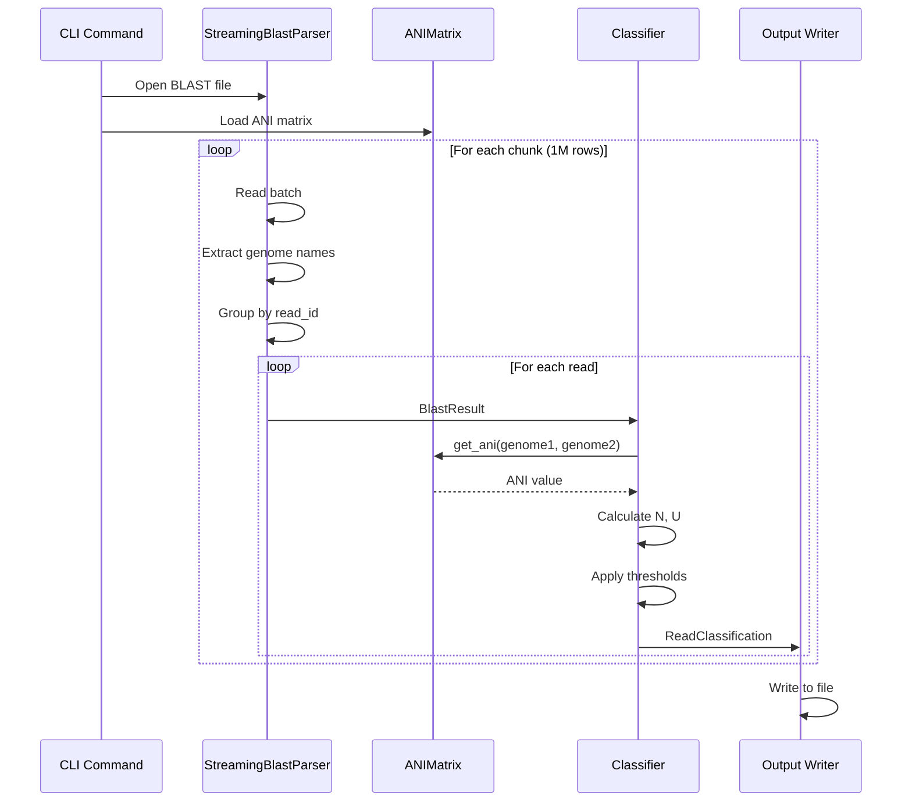
```mermaid
sequenceDiagram
    participant CLI as CLI Command
    participant Parser as StreamingBlastParser
    participant ANI as ANIMatrix
    participant Classifier as Classifier
    participant Writer as Output Writer

    CLI->>Parser: Open BLAST file
    CLI->>ANI: Load ANI matrix

    loop For each chunk (1M rows)
        Parser->>Parser: Read batch
        Parser->>Parser: Extract genome names
        Parser->>Parser: Group by read_id

        loop For each read
            Parser->>Classifier: BlastResult
            Classifier->>ANI: get_ani(genome1, genome2)
            ANI-->>Classifier: ANI value
            Classifier->>Classifier: Calculate N, U
            Classifier->>Classifier: Apply thresholds
            Classifier->>Writer: ReadClassification
        end
    end

    Writer->>Writer: Write to file
```

## Classifier Performance Tiers

```mermaid
graph LR
    subgraph tier1["Tier 1: Standard"]
        STD["ANIWeightedClassifier.classify_read()"]
        STD_DESC["Pydantic models<br/>Full validation<br/>~10K reads/sec"]
    end

    subgraph tier2["Tier 2: Fast"]
        FAST["classify_read_fast()"]
        FAST_DESC["NamedTuples<br/>Minimal validation<br/>~100K reads/sec"]
    end

    subgraph tier3["Tier 3: Parallel"]
        PAR["ParallelClassifier"]
        PAR_DESC["Multiprocessing<br/>Shared memory ANI<br/>~500K reads/sec"]
    end

    subgraph tier4["Tier 4: Vectorized"]
        VEC["VectorizedClassifier"]
        VEC_DESC["Pure Polars<br/>No Python loops<br/>~1M reads/sec"]
    end

    tier1 --> tier2
    tier2 --> tier3
    tier3 --> tier4

    style tier1 fill:#f9f,stroke:#333
    style tier2 fill:#bbf,stroke:#333
    style tier3 fill:#bfb,stroke:#333
    style tier4 fill:#ff9,stroke:#333
```

## ANI Matrix Memory Layout

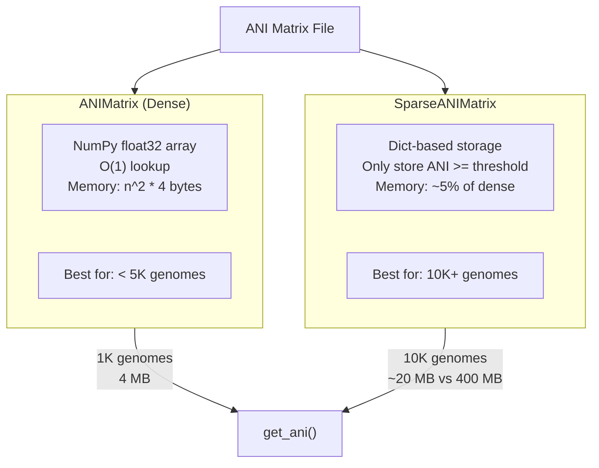
```mermaid
flowchart TB
    subgraph dense["ANIMatrix (Dense)"]
        direction LR
        D_DESC["NumPy float32 array<br/>O(1) lookup<br/>Memory: n^2 * 4 bytes"]
        D_USE["Best for: < 5K genomes"]
    end

    subgraph sparse["SparseANIMatrix"]
        direction LR
        S_DESC["Dict-based storage<br/>Only store ANI >= threshold<br/>Memory: ~5% of dense"]
        S_USE["Best for: 10K+ genomes"]
    end

    FILE["ANI Matrix File"] --> dense
    FILE --> sparse

    dense --> |"1K genomes<br/>4 MB"| LOOKUP["get_ani()"]
    sparse --> |"10K genomes<br/>~20 MB vs 400 MB"| LOOKUP
```

## Error Handling Hierarchy

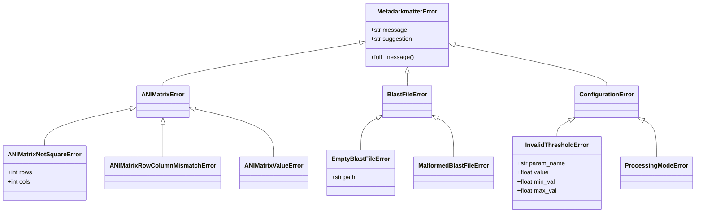
```mermaid
classDiagram
    MetadarkmatterError <|-- ANIMatrixError
    MetadarkmatterError <|-- BlastFileError
    MetadarkmatterError <|-- ConfigurationError

    ANIMatrixError <|-- ANIMatrixNotSquareError
    ANIMatrixError <|-- ANIMatrixRowColumnMismatchError
    ANIMatrixError <|-- ANIMatrixValueError

    BlastFileError <|-- EmptyBlastFileError
    BlastFileError <|-- MalformedBlastFileError

    ConfigurationError <|-- InvalidThresholdError
    ConfigurationError <|-- ProcessingModeError

    class MetadarkmatterError {
        +str message
        +str suggestion
        +full_message()
    }

    class ANIMatrixNotSquareError {
        +int rows
        +int cols
    }

    class EmptyBlastFileError {
        +str path
    }

    class InvalidThresholdError {
        +str param_name
        +float value
        +float min_val
        +float max_val
    }
```

## CLI Command Structure

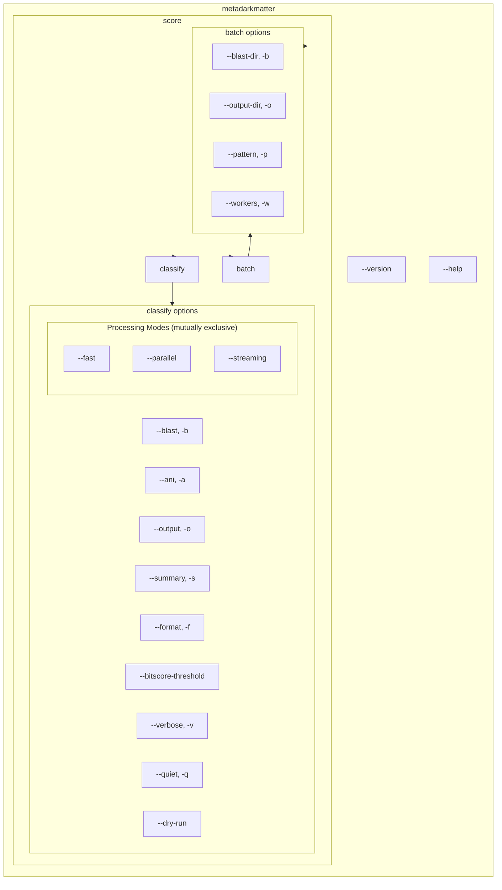
```mermaid
flowchart TB
    subgraph app["metadarkmatter"]
        VERSION["--version"]
        HELP["--help"]

        subgraph score["score"]
            CLASSIFY["classify"]
            BATCH["batch"]

            subgraph classify_opts["classify options"]
                BLAST_OPT["--blast, -b"]
                ANI_OPT["--ani, -a"]
                OUTPUT_OPT["--output, -o"]
                SUMMARY_OPT["--summary, -s"]
                FORMAT_OPT["--format, -f"]
                THRESH_OPT["--bitscore-threshold"]
                VERBOSE_OPT["--verbose, -v"]
                QUIET_OPT["--quiet, -q"]
                DRYRUN_OPT["--dry-run"]

                subgraph modes["Processing Modes (mutually exclusive)"]
                    FAST_OPT["--fast"]
                    PARALLEL_OPT["--parallel"]
                    STREAMING_OPT["--streaming"]
                end
            end

            subgraph batch_opts["batch options"]
                BLASTDIR_OPT["--blast-dir, -b"]
                OUTPUTDIR_OPT["--output-dir, -o"]
                PATTERN_OPT["--pattern, -p"]
                WORKERS_OPT["--workers, -w"]
            end
        end
    end

    app --> VERSION
    app --> HELP
    app --> score
    score --> CLASSIFY
    score --> BATCH
    CLASSIFY --> classify_opts
    BATCH --> batch_opts
```

## Data Models

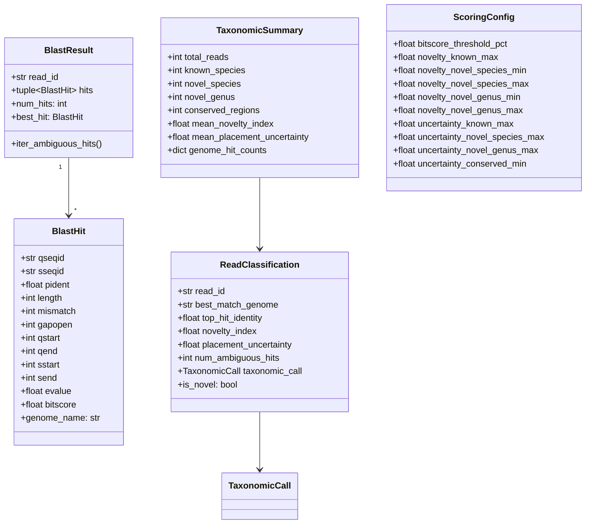
```mermaid
classDiagram
    class BlastHit {
        +str qseqid
        +str sseqid
        +float pident
        +int length
        +int mismatch
        +int gapopen
        +int qstart
        +int qend
        +int sstart
        +int send
        +float evalue
        +float bitscore
        +genome_name: str
    }

    class BlastResult {
        +str read_id
        +tuple~BlastHit~ hits
        +num_hits: int
        +best_hit: BlastHit
        +iter_ambiguous_hits()
    }

    class ReadClassification {
        +str read_id
        +str best_match_genome
        +float top_hit_identity
        +float novelty_index
        +float placement_uncertainty
        +int num_ambiguous_hits
        +TaxonomicCall taxonomic_call
        +is_novel: bool
    }

    class TaxonomicSummary {
        +int total_reads
        +int known_species
        +int novel_species
        +int novel_genus
        +int conserved_regions
        +float mean_novelty_index
        +float mean_placement_uncertainty
        +dict genome_hit_counts
    }

    class ScoringConfig {
        +float bitscore_threshold_pct
        +float novelty_known_max
        +float novelty_novel_species_min
        +float novelty_novel_species_max
        +float novelty_novel_genus_min
        +float novelty_novel_genus_max
        +float uncertainty_known_max
        +float uncertainty_novel_species_max
        +float uncertainty_novel_genus_max
        +float uncertainty_conserved_min
    }

    BlastResult "1" --> "*" BlastHit
    ReadClassification --> TaxonomicCall
    TaxonomicSummary --> ReadClassification
```

## Batch Processing Flow

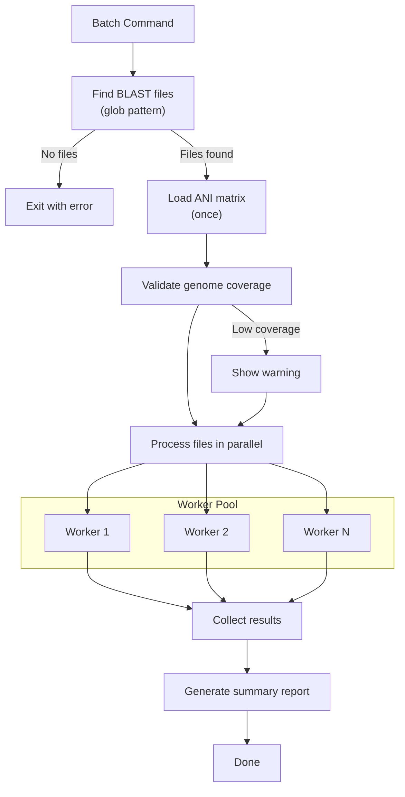
```mermaid
flowchart TD
    START["Batch Command"]

    START --> FIND["Find BLAST files<br/>(glob pattern)"]
    FIND --> |"No files"| ERROR["Exit with error"]
    FIND --> |"Files found"| LOAD["Load ANI matrix<br/>(once)"]

    LOAD --> VALIDATE["Validate genome coverage"]
    VALIDATE --> |"Low coverage"| WARN["Show warning"]
    VALIDATE --> PROCESS
    WARN --> PROCESS

    PROCESS["Process files in parallel"]

    subgraph workers["Worker Pool"]
        W1["Worker 1"]
        W2["Worker 2"]
        W3["Worker N"]
    end

    PROCESS --> W1
    PROCESS --> W2
    PROCESS --> W3

    W1 --> COLLECT["Collect results"]
    W2 --> COLLECT
    W3 --> COLLECT

    COLLECT --> REPORT["Generate summary report"]
    REPORT --> DONE["Done"]
```

## Memory Usage by Processing Mode

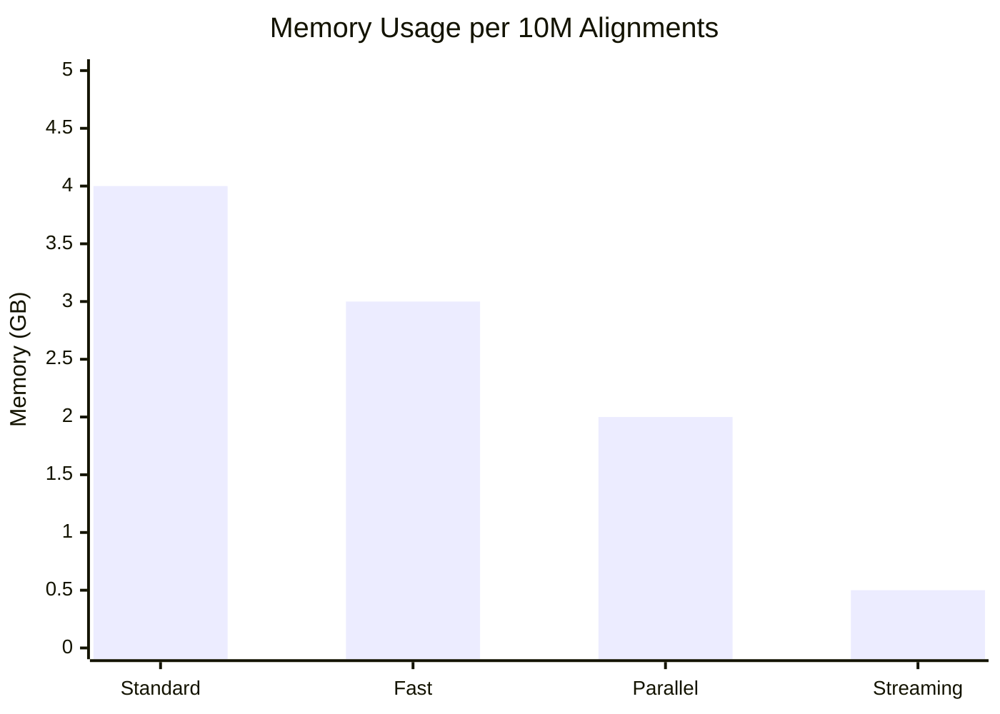
```mermaid
xychart-beta
    title "Memory Usage per 10M Alignments"
    x-axis ["Standard", "Fast", "Parallel", "Streaming"]
    y-axis "Memory (GB)" 0 --> 5
    bar [4, 3, 2, 0.5]
```

## Recommended Mode Selection

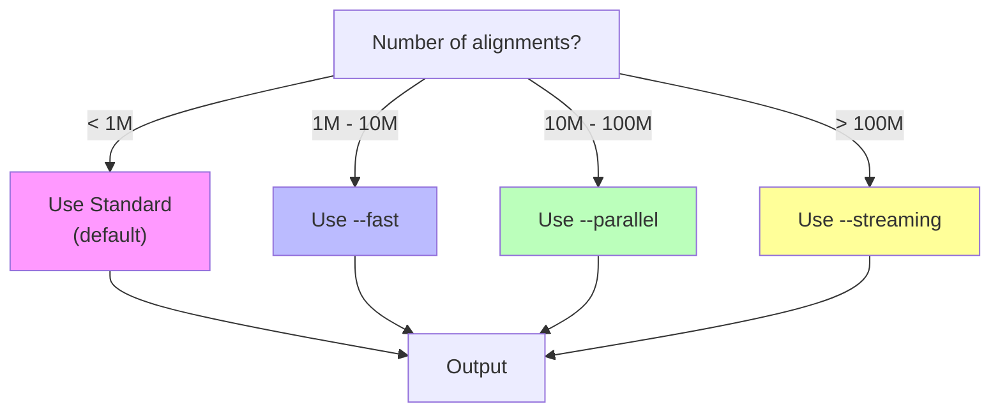
```mermaid
flowchart TD
    START["Number of alignments?"]

    START --> |"< 1M"| STD["Use Standard<br/>(default)"]
    START --> |"1M - 10M"| FAST["Use --fast"]
    START --> |"10M - 100M"| PAR["Use --parallel"]
    START --> |"> 100M"| STREAM["Use --streaming"]

    STD --> OUTPUT["Output"]
    FAST --> OUTPUT
    PAR --> OUTPUT
    STREAM --> OUTPUT

    style STD fill:#f9f
    style FAST fill:#bbf
    style PAR fill:#bfb
    style STREAM fill:#ff9
```

## Visualization Architecture

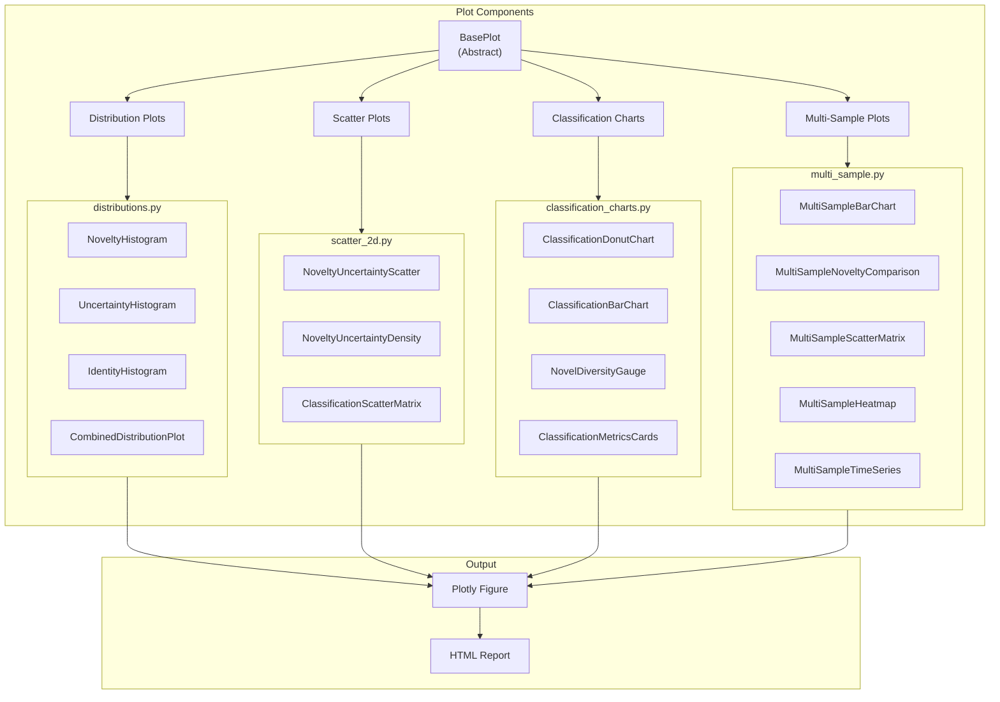
```mermaid
flowchart TB
    subgraph plots["Plot Components"]
        direction TB
        BASE["BasePlot<br/>(Abstract)"]

        BASE --> DIST["Distribution Plots"]
        BASE --> SCATTER["Scatter Plots"]
        BASE --> CHARTS["Classification Charts"]
        BASE --> MULTI["Multi-Sample Plots"]

        subgraph DIST_TYPES["distributions.py"]
            NOV_HIST["NoveltyHistogram"]
            UNC_HIST["UncertaintyHistogram"]
            ID_HIST["IdentityHistogram"]
            COMB_DIST["CombinedDistributionPlot"]
        end

        subgraph SCATTER_TYPES["scatter_2d.py"]
            NOV_UNC["NoveltyUncertaintyScatter"]
            NOV_DENS["NoveltyUncertaintyDensity"]
            SCATTER_MAT["ClassificationScatterMatrix"]
        end

        subgraph CHART_TYPES["classification_charts.py"]
            DONUT["ClassificationDonutChart"]
            BAR["ClassificationBarChart"]
            GAUGE["NovelDiversityGauge"]
            CARDS["ClassificationMetricsCards"]
        end

        subgraph MULTI_TYPES["multi_sample.py"]
            MS_BAR["MultiSampleBarChart"]
            MS_BOX["MultiSampleNoveltyComparison"]
            MS_SCATTER["MultiSampleScatterMatrix"]
            MS_HEAT["MultiSampleHeatmap"]
            MS_TREND["MultiSampleTimeSeries"]
        end

        DIST --> DIST_TYPES
        SCATTER --> SCATTER_TYPES
        CHARTS --> CHART_TYPES
        MULTI --> MULTI_TYPES
    end

    subgraph output["Output"]
        PLOTLY["Plotly Figure"]
        HTML["HTML Report"]
    end

    DIST_TYPES --> PLOTLY
    SCATTER_TYPES --> PLOTLY
    CHART_TYPES --> PLOTLY
    MULTI_TYPES --> PLOTLY
    PLOTLY --> HTML
```

## Report Generation Flow

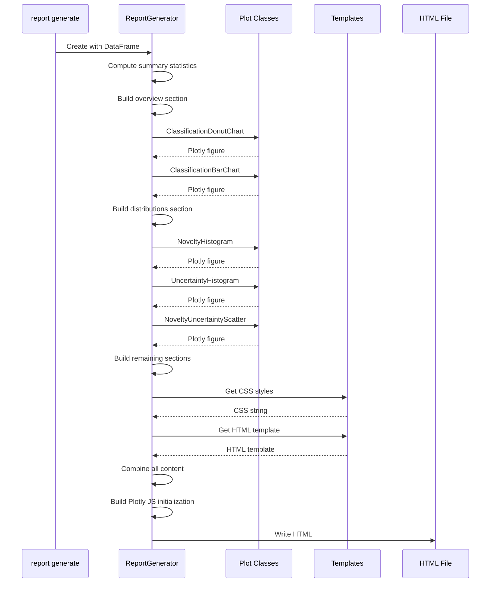
```mermaid
sequenceDiagram
    participant CLI as report generate
    participant Gen as ReportGenerator
    participant Plots as Plot Classes
    participant Template as Templates
    participant File as HTML File

    CLI->>Gen: Create with DataFrame
    Gen->>Gen: Compute summary statistics

    Gen->>Gen: Build overview section
    Gen->>Plots: ClassificationDonutChart
    Plots-->>Gen: Plotly figure
    Gen->>Plots: ClassificationBarChart
    Plots-->>Gen: Plotly figure

    Gen->>Gen: Build distributions section
    Gen->>Plots: NoveltyHistogram
    Plots-->>Gen: Plotly figure
    Gen->>Plots: UncertaintyHistogram
    Plots-->>Gen: Plotly figure
    Gen->>Plots: NoveltyUncertaintyScatter
    Plots-->>Gen: Plotly figure

    Gen->>Gen: Build remaining sections

    Gen->>Template: Get CSS styles
    Template-->>Gen: CSS string
    Gen->>Template: Get HTML template
    Template-->>Gen: HTML template

    Gen->>Gen: Combine all content
    Gen->>Gen: Build Plotly JS initialization

    Gen->>File: Write HTML
```

## Report Structure

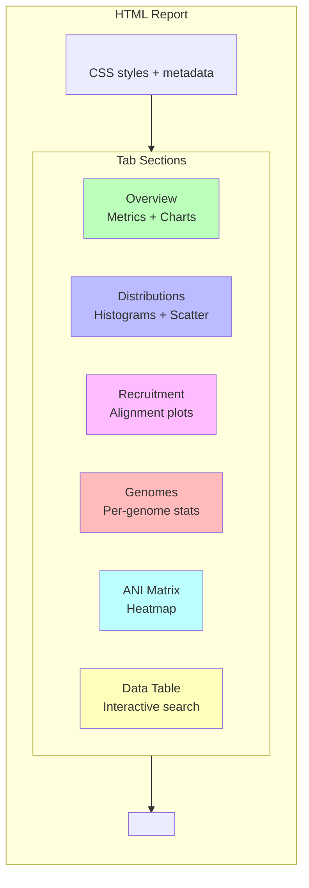
```mermaid
flowchart TB
    subgraph report["HTML Report"]
        direction TB

        HEAD["<head><br/>CSS styles + metadata"]

        subgraph tabs["Tab Sections"]
            direction LR
            OVERVIEW["Overview<br/>Metrics + Charts"]
            DIST["Distributions<br/>Histograms + Scatter"]
            RECRUIT["Recruitment<br/>Alignment plots"]
            GENOMES["Genomes<br/>Per-genome stats"]
            ANI["ANI Matrix<br/>Heatmap"]
            DATA["Data Table<br/>Interactive search"]
        end

        SCRIPTS["<script><br/>Tab navigation + Plotly init"]
    end

    HEAD --> tabs
    tabs --> SCRIPTS

    style OVERVIEW fill:#bfb
    style DIST fill:#bbf
    style RECRUIT fill:#fbf
    style GENOMES fill:#fbb
    style ANI fill:#bff
    style DATA fill:#ffb
```

## Multi-Sample Report Architecture

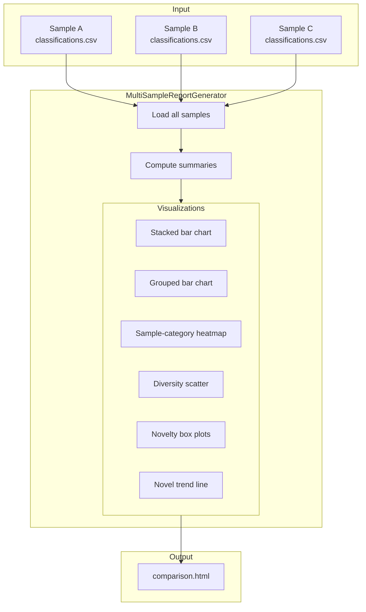
```mermaid
flowchart TB
    subgraph inputs["Input"]
        S1["Sample A<br/>classifications.csv"]
        S2["Sample B<br/>classifications.csv"]
        S3["Sample C<br/>classifications.csv"]
    end

    subgraph processing["MultiSampleReportGenerator"]
        LOAD["Load all samples"]
        COMPUTE["Compute summaries"]

        subgraph viz["Visualizations"]
            STACKED["Stacked bar chart"]
            GROUPED["Grouped bar chart"]
            HEATMAP["Sample-category heatmap"]
            SCATTER["Diversity scatter"]
            BOXPLOT["Novelty box plots"]
            TREND["Novel trend line"]
        end
    end

    subgraph output["Output"]
        HTML["comparison.html"]
    end

    S1 --> LOAD
    S2 --> LOAD
    S3 --> LOAD

    LOAD --> COMPUTE
    COMPUTE --> viz
    viz --> HTML
```

## CLI Command Structure (Updated)

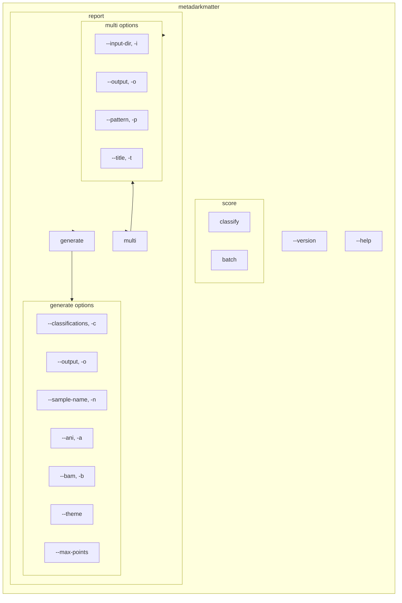
```mermaid
flowchart TB
    subgraph app["metadarkmatter"]
        VERSION["--version"]
        HELP["--help"]

        subgraph score["score"]
            CLASSIFY["classify"]
            BATCH["batch"]
        end

        subgraph report["report"]
            GENERATE["generate"]
            MULTI["multi"]

            subgraph gen_opts["generate options"]
                CLASS_OPT["--classifications, -c"]
                OUT_OPT["--output, -o"]
                NAME_OPT["--sample-name, -n"]
                ANI_OPT["--ani, -a"]
                BAM_OPT["--bam, -b"]
                THEME_OPT["--theme"]
                MAX_PTS["--max-points"]
            end

            subgraph multi_opts["multi options"]
                INDIR_OPT["--input-dir, -i"]
                OUTM_OPT["--output, -o"]
                PATTERN_OPT["--pattern, -p"]
                TITLE_OPT["--title, -t"]
            end
        end
    end

    app --> VERSION
    app --> HELP
    app --> score
    app --> report
    report --> GENERATE
    report --> MULTI
    GENERATE --> gen_opts
    MULTI --> multi_opts
```

## Theme System

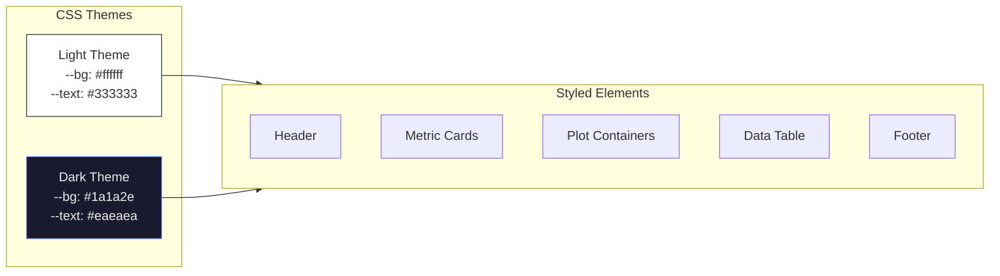
```mermaid
flowchart LR
    subgraph themes["CSS Themes"]
        LIGHT["Light Theme<br/>--bg: #ffffff<br/>--text: #333333"]
        DARK["Dark Theme<br/>--bg: #1a1a2e<br/>--text: #eaeaea"]
    end

    subgraph elements["Styled Elements"]
        HEADER["Header"]
        CARDS["Metric Cards"]
        PLOTS["Plot Containers"]
        TABLE["Data Table"]
        FOOTER["Footer"]
    end

    LIGHT --> elements
    DARK --> elements

    style LIGHT fill:#fff,stroke:#333
    style DARK fill:#1a1a2e,stroke:#667eea,color:#eaeaea
```

## Plot Color Palette

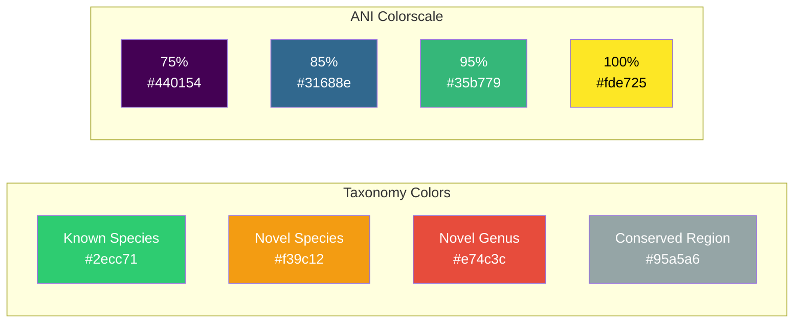
```mermaid
flowchart LR
    subgraph taxonomy["Taxonomy Colors"]
        KNOWN["Known Species<br/>#2ecc71"]
        NOVEL_SP["Novel Species<br/>#f39c12"]
        NOVEL_GEN["Novel Genus<br/>#e74c3c"]
        CONSERVED["Conserved Region<br/>#95a5a6"]
    end

    subgraph ani["ANI Colorscale"]
        ANI75["75%<br/>#440154"]
        ANI85["85%<br/>#31688e"]
        ANI95["95%<br/>#35b779"]
        ANI100["100%<br/>#fde725"]
    end

    style KNOWN fill:#2ecc71,color:#fff
    style NOVEL_SP fill:#f39c12,color:#fff
    style NOVEL_GEN fill:#e74c3c,color:#fff
    style CONSERVED fill:#95a5a6,color:#fff
    style ANI75 fill:#440154,color:#fff
    style ANI85 fill:#31688e,color:#fff
    style ANI95 fill:#35b779,color:#fff
    style ANI100 fill:#fde725,color:#000
```
