# Metadarkmatter Architecture

This document provides visual diagrams of the metadarkmatter system architecture, data flow, and component relationships.

## System Overview

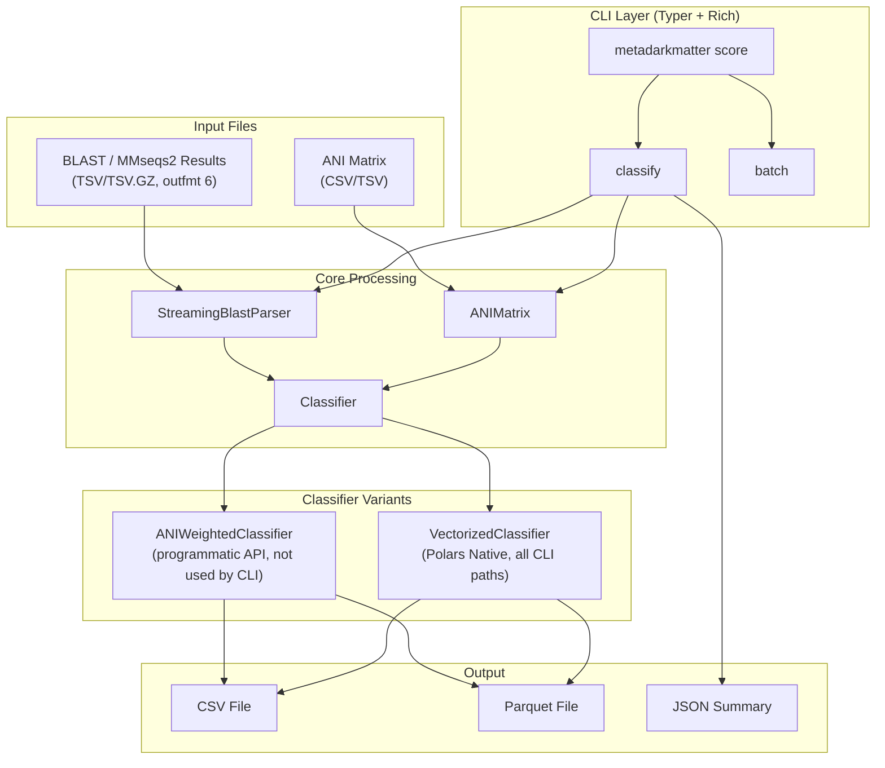
```mermaid
flowchart TB
    subgraph Inputs["Input Files"]
        BLAST["BLAST / MMseqs2 Results<br/>(TSV/TSV.GZ, outfmt 6)"]
        ANI["ANI Matrix<br/>(CSV/TSV)"]
    end

    subgraph CLI["CLI Layer (Typer + Rich)"]
        CMD["metadarkmatter score"]
        CLASSIFY["classify"]
        BATCH["batch"]
    end

    subgraph Core["Core Processing"]
        PARSER["StreamingBlastParser"]
        ANIMAT["ANIMatrix"]
        CLASS["Classifier"]
    end

    subgraph Classifiers["Classifier Variants"]
        STD["ANIWeightedClassifier<br/>(programmatic API, not used by CLI)"]
        VEC["VectorizedClassifier<br/>(Polars Native, all CLI paths)"]
    end

    subgraph Output["Output"]
        CSV["CSV File"]
        PARQUET["Parquet File"]
        SUMMARY["JSON Summary"]
    end

    BLAST --> PARSER
    ANI --> ANIMAT

    CMD --> CLASSIFY
    CMD --> BATCH

    CLASSIFY --> PARSER
    CLASSIFY --> ANIMAT

    PARSER --> CLASS
    ANIMAT --> CLASS

    CLASS --> STD
    CLASS --> VEC

    STD --> CSV
    VEC --> CSV

    STD --> PARQUET
    VEC --> PARQUET

    CLASSIFY --> SUMMARY
```

## Package Structure

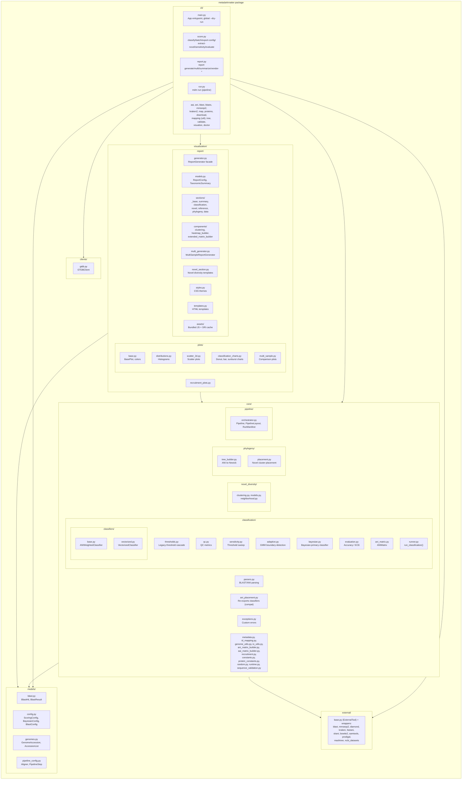
```mermaid
flowchart LR
    subgraph metadarkmatter["metadarkmatter package"]
        direction TB

        subgraph cli["cli/"]
            main["main.py<br/>App entrypoint, global --dry-run"]
            score["score.py<br/>classify/batch/export-config/<br/>extract-novel/sensitivity/evaluate"]
            report_cli["report.py<br/>report generate/multi/summarize/vendor-*"]
            run_cli["run.py<br/>mdm run (pipeline)"]
            other_cli["aai, ani, blast, blastx, mmseqs2,<br/>kraken2, map, proteins, download,<br/>mapping (util), tree, validate,<br/>visualize, doctor"]
        end

        subgraph core["core/"]
            parsers["parsers.py<br/>BLAST/ANI parsing"]
            ani_placement["ani_placement.py<br/>Re-exports classifiers (compat)"]
            exceptions["exceptions.py<br/>Custom errors"]
            core_misc["metadata.py, id_mapping.py,<br/>genome_utils.py, io_utils.py,<br/>ani_matrix_builder.py, aai_matrix_builder.py,<br/>recruitment.py,<br/>constants.py, protein_constants.py,<br/>random.py, runtime.py, sequence_validation.py"]

            subgraph classification["classification/"]
                thresholds_mod["thresholds.py<br/>Legacy threshold cascade"]
                qc_mod["qc.py<br/>QC metrics"]
                sensitivity_mod["sensitivity.py<br/>Threshold sweep"]
                adaptive_mod["adaptive.py<br/>GMM boundary detection"]
                bayesian_mod["bayesian.py<br/>Bayesian-primary classifier"]
                evaluation_mod["evaluation.py<br/>Accuracy / ECE"]
                ani_matrix_mod["ani_matrix.py<br/>ANIMatrix"]
                runner_mod["runner.py<br/>run_classification()"]

                subgraph classifiers["classifiers/"]
                    base_cls["base.py<br/>ANIWeightedClassifier"]
                    vec_cls["vectorized.py<br/>VectorizedClassifier"]
                end
            end

            subgraph novel_diversity["novel_diversity/"]
                nd_mods["clustering.py, models.py,<br/>neighborhood.py"]
            end

            subgraph phylogeny["phylogeny/"]
                tree_builder["tree_builder.py<br/>ANI-to-Newick"]
                placement["placement.py<br/>Novel cluster placement"]
            end

            subgraph pipeline["pipeline/"]
                orchestrator["orchestrator.py<br/>Pipeline, PipelineLayout, RunManifest"]
            end
        end

        subgraph models["models/"]
            blast["blast.py<br/>BlastHit, BlastResult"]
            classification["classification.py<br/>ReadClassification, TaxonomicSummary"]
            config["config.py<br/>ScoringConfig, BayesianConfig, BlastConfig"]
            genomes["genomes.py<br/>GenomeAccession, AccessionList"]
            pipeline_config["pipeline_config.py<br/>Aligner, PipelineStep"]
        end

        subgraph external["external/"]
            ext_mods["base.py (ExternalTool) + wrappers:<br/>blast, mmseqs2, diamond, kraken, fastani,<br/>skani, bowtie2, samtools, prodigal,<br/>mashtree, ncbi_datasets"]
        end

        subgraph clients["clients/"]
            gtdb["gtdb.py<br/>GTDBClient"]
        end

        subgraph visualization["visualization/"]
            recruitment_plots["recruitment_plots.py"]
            subgraph plots["plots/"]
                base["base.py<br/>BasePlot, colors"]
                distributions["distributions.py<br/>Histograms"]
                scatter["scatter_2d.py<br/>Scatter plots"]
                charts["classification_charts.py<br/>Donut, bar, sunburst charts"]
                multi["multi_sample.py<br/>Comparison plots"]
            end
            subgraph report["report/"]
                generator["generator.py<br/>ReportGenerator facade"]
                report_models["models.py<br/>ReportConfig, TaxonomicSummary"]
                sections["sections/<br/>_base, summary, classification,<br/>novel, reference, phylogeny, data"]
                components["components/<br/>clustering, heatmap_builder,<br/>extended_matrix_builder"]
                multi_gen["multi_generator.py<br/>MultiSampleReportGenerator"]
                novel_section["novel_section.py<br/>Novel-diversity templates"]
                styles["styles.py<br/>CSS themes"]
                templates["templates.py<br/>HTML templates"]
                assets["assets/<br/>Bundled JS + SRI cache"]
            end
        end
    end

    cli --> core
    cli --> models
    cli --> visualization
    cli --> external
    cli --> clients
    core --> models
    core --> external
    visualization --> models
    visualization --> core
```

## Classification Algorithm

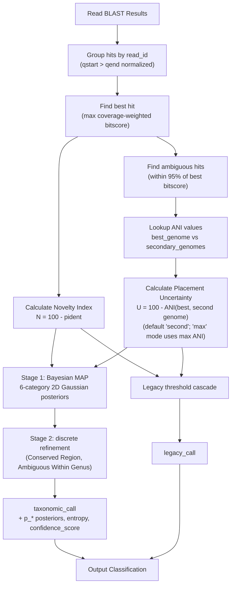
```mermaid
flowchart TD
    START["Read BLAST Results"]

    START --> GROUP["Group hits by read_id<br/>(qstart > qend normalized)"]
    GROUP --> BEST["Find best hit<br/>(max coverage-weighted bitscore)"]

    BEST --> N["Calculate Novelty Index<br/>N = 100 - pident"]
    BEST --> AMBHITS["Find ambiguous hits<br/>(within 95% of best bitscore)"]

    AMBHITS --> ANI["Lookup ANI values<br/>best_genome vs secondary_genomes"]
    ANI --> U["Calculate Placement Uncertainty<br/>U = 100 - ANI(best, second genome)<br/>(default 'second'; 'max' mode uses max ANI)"]

    N --> BAYES["Stage 1: Bayesian MAP<br/>6-category 2D Gaussian posteriors"]
    U --> BAYES
    BAYES --> STAGE2["Stage 2: discrete refinement<br/>(Conserved Region, Ambiguous Within Genus)"]
    STAGE2 --> CALL["taxonomic_call<br/>+ p_* posteriors, entropy, confidence_score"]

    N --> THRESHOLD["Legacy threshold cascade"]
    U --> THRESHOLD
    THRESHOLD --> LEGACY["legacy_call"]

    CALL --> OUTPUT["Output Classification"]
    LEGACY --> OUTPUT
```

The legacy cascade (`core/classification/thresholds.py`) applies, in order: identity gap < 2 with >1 hit -> Ambiguous; U >= 5 across genera -> Conserved Region; U >= 5 -> Ambiguous; U >= 1.5 -> Species Boundary; N < 4 and U < 1.5 -> Known Species; single-hit read with high inferred uncertainty -> Ambiguous; 4 <= N < 20 -> Novel Species; 20 <= N <= 25 -> Novel Genus; otherwise Unclassified. The Bayesian boundaries in `taxonomic_call` do not coincide exactly with these thresholds.

## Data Flow: Streaming Processing

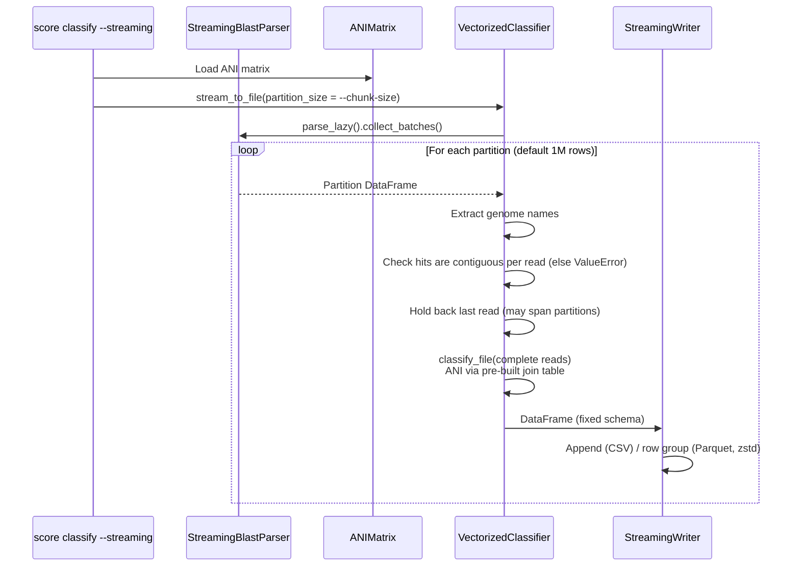
```mermaid
sequenceDiagram
    participant CLI as score classify --streaming
    participant Parser as StreamingBlastParser
    participant ANI as ANIMatrix
    participant Classifier as VectorizedClassifier
    participant Writer as StreamingWriter

    CLI->>ANI: Load ANI matrix
    CLI->>Classifier: stream_to_file(partition_size = --chunk-size)
    Classifier->>Parser: parse_lazy().collect_batches()

    loop For each partition (default 1M rows)
        Parser-->>Classifier: Partition DataFrame
        Classifier->>Classifier: Extract genome names
        Classifier->>Classifier: Check hits are contiguous per read (else ValueError)
        Classifier->>Classifier: Hold back last read (may span partitions)
        Classifier->>Classifier: classify_file(complete reads)<br/>ANI via pre-built join table
        Classifier->>Writer: DataFrame (fixed schema)
        Writer->>Writer: Append (CSV) / row group (Parquet, zstd)
    end
```

Streaming requires each read's hits to be contiguous (as BLAST and MMseqs2 emit them) and is not combined with `--id-mapping` / `--genomes` (the classification runner rejects that combination).

## Classifier Performance Tiers

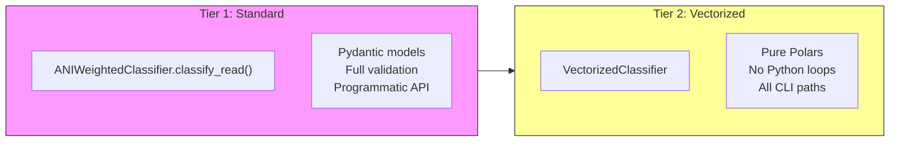
```mermaid
graph LR
    subgraph tier1["Tier 1: Standard"]
        STD["ANIWeightedClassifier.classify_read()"]
        STD_DESC["Pydantic models<br/>Full validation<br/>Programmatic API"]
    end

    subgraph tier2["Tier 2: Vectorized"]
        VEC["VectorizedClassifier"]
        VEC_DESC["Pure Polars<br/>No Python loops<br/>All CLI paths"]
    end

    tier1 --> tier2

    style tier1 fill:#f9f,stroke:#333
    style tier2 fill:#ff9,stroke:#333
```

## ANI Matrix Memory Layout

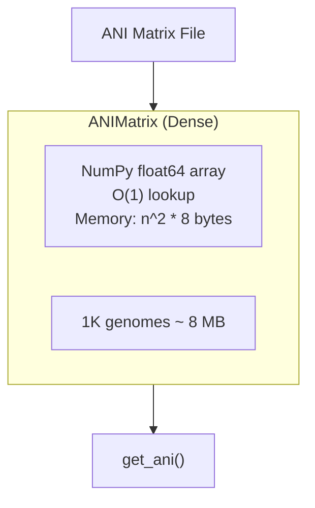
```mermaid
flowchart TB
    subgraph dense["ANIMatrix (Dense)"]
        direction LR
        D_DESC["NumPy float64 array<br/>O(1) lookup<br/>Memory: n^2 * 8 bytes"]
        D_USE["1K genomes ~ 8 MB"]
    end

    FILE["ANI Matrix File"] --> dense
    dense --> LOOKUP["get_ani()"]
```

## Error Handling Hierarchy

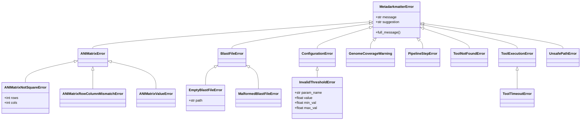
```mermaid
classDiagram
    MetadarkmatterError <|-- ANIMatrixError
    MetadarkmatterError <|-- BlastFileError
    MetadarkmatterError <|-- ConfigurationError
    MetadarkmatterError <|-- GenomeCoverageWarning
    MetadarkmatterError <|-- PipelineStepError
    MetadarkmatterError <|-- ToolNotFoundError
    MetadarkmatterError <|-- ToolExecutionError
    MetadarkmatterError <|-- UnsafePathError
    ToolExecutionError <|-- ToolTimeoutError

    ANIMatrixError <|-- ANIMatrixNotSquareError
    ANIMatrixError <|-- ANIMatrixRowColumnMismatchError
    ANIMatrixError <|-- ANIMatrixValueError

    BlastFileError <|-- EmptyBlastFileError
    BlastFileError <|-- MalformedBlastFileError

    ConfigurationError <|-- InvalidThresholdError

    class MetadarkmatterError {
        +str message
        +str suggestion
        +full_message()
    }

    class ANIMatrixNotSquareError {
        +int rows
        +int cols
    }

    class EmptyBlastFileError {
        +str path
    }

    class InvalidThresholdError {
        +str param_name
        +float value
        +float min_val
        +float max_val
    }
```

`ToolNotFoundError`, `ToolExecutionError`, `ToolTimeoutError` and `UnsafePathError` are defined in `external/base.py`; `PipelineStepError` in `core/pipeline/orchestrator.py`; the others in `core/exceptions.py`. External tools run without a timeout by default (`ExternalTool.DEFAULT_TIMEOUT = None`); when a timeout is set and exceeded, `ToolTimeoutError` is raised and can be handled as a `ToolExecutionError`.

## CLI Command Structure

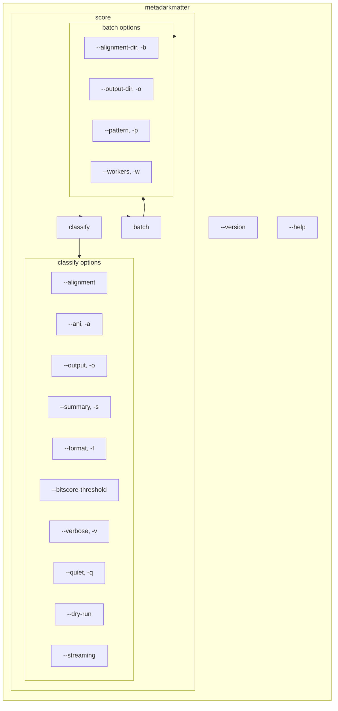
```mermaid
flowchart TB
    subgraph app["metadarkmatter"]
        VERSION["--version"]
        HELP["--help"]

        subgraph score["score"]
            CLASSIFY["classify"]
            BATCH["batch"]

            subgraph classify_opts["classify options"]
                BLAST_OPT["--alignment"]
                ANI_OPT["--ani, -a"]
                OUTPUT_OPT["--output, -o"]
                SUMMARY_OPT["--summary, -s"]
                FORMAT_OPT["--format, -f"]
                THRESH_OPT["--bitscore-threshold"]
                VERBOSE_OPT["--verbose, -v"]
                QUIET_OPT["--quiet, -q"]
                DRYRUN_OPT["--dry-run"]
                STREAMING_OPT["--streaming"]
            end

            subgraph batch_opts["batch options"]
                BLASTDIR_OPT["--alignment-dir, -b"]
                OUTPUTDIR_OPT["--output-dir, -o"]
                PATTERN_OPT["--pattern, -p"]
                WORKERS_OPT["--workers, -w"]
            end
        end
    end

    app --> VERSION
    app --> HELP
    app --> score
    score --> CLASSIFY
    score --> BATCH
    CLASSIFY --> classify_opts
    BATCH --> batch_opts
```

## Data Models

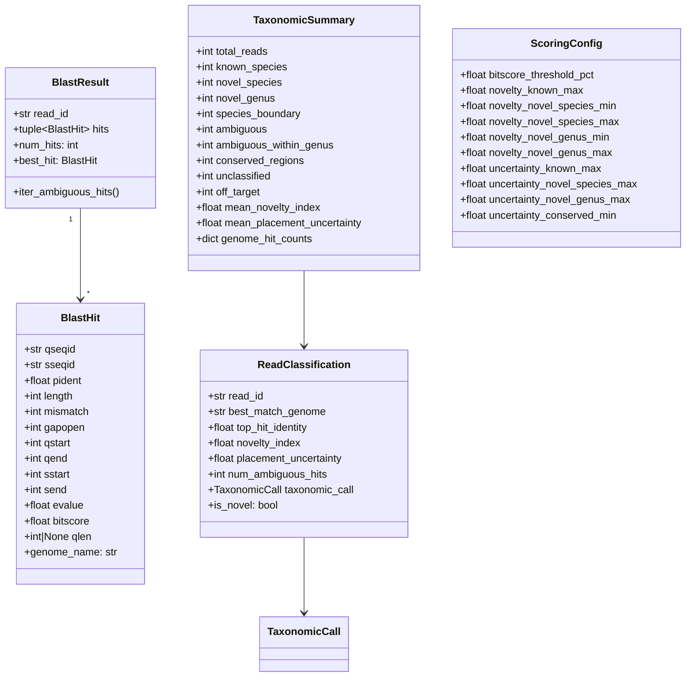
```mermaid
classDiagram
    class BlastHit {
        +str qseqid
        +str sseqid
        +float pident
        +int length
        +int mismatch
        +int gapopen
        +int qstart
        +int qend
        +int sstart
        +int send
        +float evalue
        +float bitscore
        +int|None qlen
        +genome_name: str
    }

    class BlastResult {
        +str read_id
        +tuple~BlastHit~ hits
        +num_hits: int
        +best_hit: BlastHit
        +iter_ambiguous_hits()
    }

    class ReadClassification {
        +str read_id
        +str best_match_genome
        +float top_hit_identity
        +float novelty_index
        +float placement_uncertainty
        +int num_ambiguous_hits
        +TaxonomicCall taxonomic_call
        +is_novel: bool
    }

    class TaxonomicSummary {
        +int total_reads
        +int known_species
        +int novel_species
        +int novel_genus
        +int species_boundary
        +int ambiguous
        +int ambiguous_within_genus
        +int conserved_regions
        +int unclassified
        +int off_target
        +float mean_novelty_index
        +float mean_placement_uncertainty
        +dict genome_hit_counts
    }

    class ScoringConfig {
        +float bitscore_threshold_pct
        +float novelty_known_max
        +float novelty_novel_species_min
        +float novelty_novel_species_max
        +float novelty_novel_genus_min
        +float novelty_novel_genus_max
        +float uncertainty_known_max
        +float uncertainty_novel_species_max
        +float uncertainty_novel_genus_max
        +float uncertainty_conserved_min
    }

    BlastResult "1" --> "*" BlastHit
    ReadClassification --> TaxonomicCall
    TaxonomicSummary --> ReadClassification
```

## Batch Processing Flow

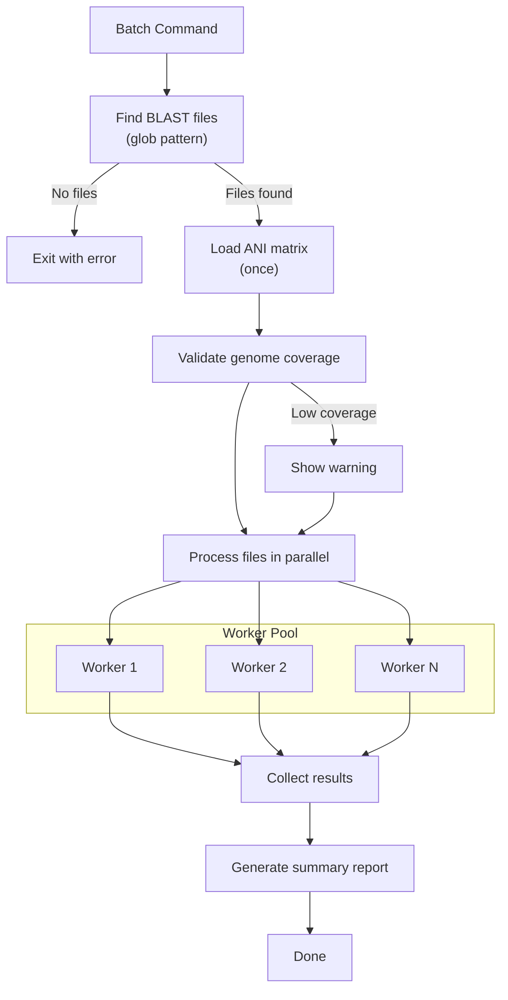
```mermaid
flowchart TD
    START["Batch Command"]

    START --> FIND["Find BLAST files<br/>(glob pattern)"]
    FIND --> |"No files"| ERROR["Exit with error"]
    FIND --> |"Files found"| LOAD["Load ANI matrix<br/>(once)"]

    LOAD --> VALIDATE["Validate genome coverage"]
    VALIDATE --> |"Low coverage"| WARN["Show warning"]
    VALIDATE --> PROCESS
    WARN --> PROCESS

    PROCESS["Process files in parallel"]

    subgraph workers["Worker Pool"]
        W1["Worker 1"]
        W2["Worker 2"]
        W3["Worker N"]
    end

    PROCESS --> W1
    PROCESS --> W2
    PROCESS --> W3

    W1 --> COLLECT["Collect results"]
    W2 --> COLLECT
    W3 --> COLLECT

    COLLECT --> REPORT["Generate summary report"]
    REPORT --> DONE["Done"]
```

## Memory Usage by Processing Mode

The default (vectorized, in-memory) mode loads the full alignment table; its own estimate is about 1.5x the uncompressed file size (`VectorizedClassifier._check_memory`), and `CLAUDE.md` reports an estimate of about 18 GB at 10M hits. Streaming mode bounds memory by the partition size (`--chunk-size`, default 1,000,000 rows). No measured per-mode figures are maintained in this document.

## Recommended Mode Selection

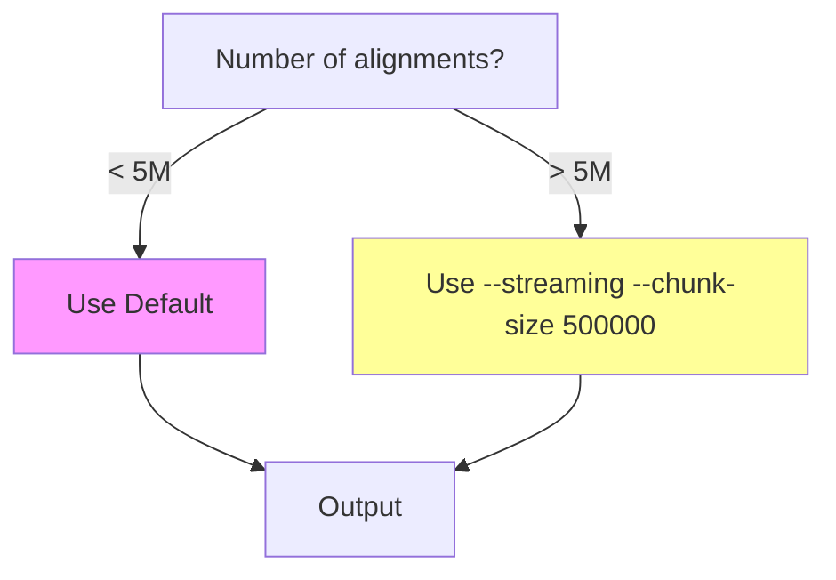
```mermaid
flowchart TD
    START["Number of alignments?"]

    START --> |"< 5M"| DEFAULT["Use Default"]
    START --> |"> 5M"| STREAM["Use --streaming --chunk-size 500000"]

    DEFAULT --> OUTPUT["Output"]
    STREAM --> OUTPUT

    style DEFAULT fill:#f9f
    style STREAM fill:#ff9
```

## Visualization Architecture

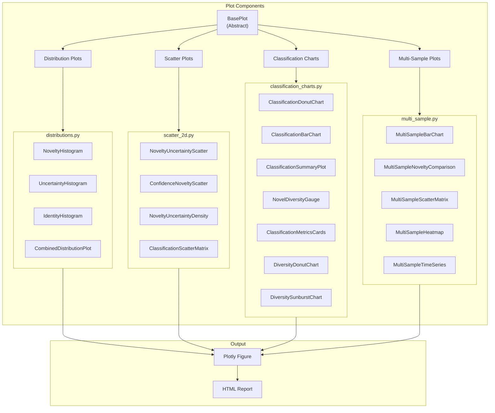
```mermaid
flowchart TB
    subgraph plots["Plot Components"]
        direction TB
        BASE["BasePlot<br/>(Abstract)"]

        BASE --> DIST["Distribution Plots"]
        BASE --> SCATTER["Scatter Plots"]
        BASE --> CHARTS["Classification Charts"]
        BASE --> MULTI["Multi-Sample Plots"]

        subgraph DIST_TYPES["distributions.py"]
            NOV_HIST["NoveltyHistogram"]
            UNC_HIST["UncertaintyHistogram"]
            ID_HIST["IdentityHistogram"]
            COMB_DIST["CombinedDistributionPlot"]
        end

        subgraph SCATTER_TYPES["scatter_2d.py"]
            NOV_UNC["NoveltyUncertaintyScatter"]
            CONF_NOV["ConfidenceNoveltyScatter"]
            NOV_DENS["NoveltyUncertaintyDensity"]
            SCATTER_MAT["ClassificationScatterMatrix"]
        end

        subgraph CHART_TYPES["classification_charts.py"]
            DONUT["ClassificationDonutChart"]
            BAR["ClassificationBarChart"]
            SUMMARY_PLOT["ClassificationSummaryPlot"]
            GAUGE["NovelDiversityGauge"]
            CARDS["ClassificationMetricsCards"]
            DIV_DONUT["DiversityDonutChart"]
            SUNBURST["DiversitySunburstChart"]
        end

        subgraph MULTI_TYPES["multi_sample.py"]
            MS_BAR["MultiSampleBarChart"]
            MS_BOX["MultiSampleNoveltyComparison"]
            MS_SCATTER["MultiSampleScatterMatrix"]
            MS_HEAT["MultiSampleHeatmap"]
            MS_TREND["MultiSampleTimeSeries"]
        end

        DIST --> DIST_TYPES
        SCATTER --> SCATTER_TYPES
        CHARTS --> CHART_TYPES
        MULTI --> MULTI_TYPES
    end

    subgraph output["Output"]
        PLOTLY["Plotly Figure"]
        HTML["HTML Report"]
    end

    DIST_TYPES --> PLOTLY
    SCATTER_TYPES --> PLOTLY
    CHART_TYPES --> PLOTLY
    MULTI_TYPES --> PLOTLY
    PLOTLY --> HTML
```

## Report Generation Flow

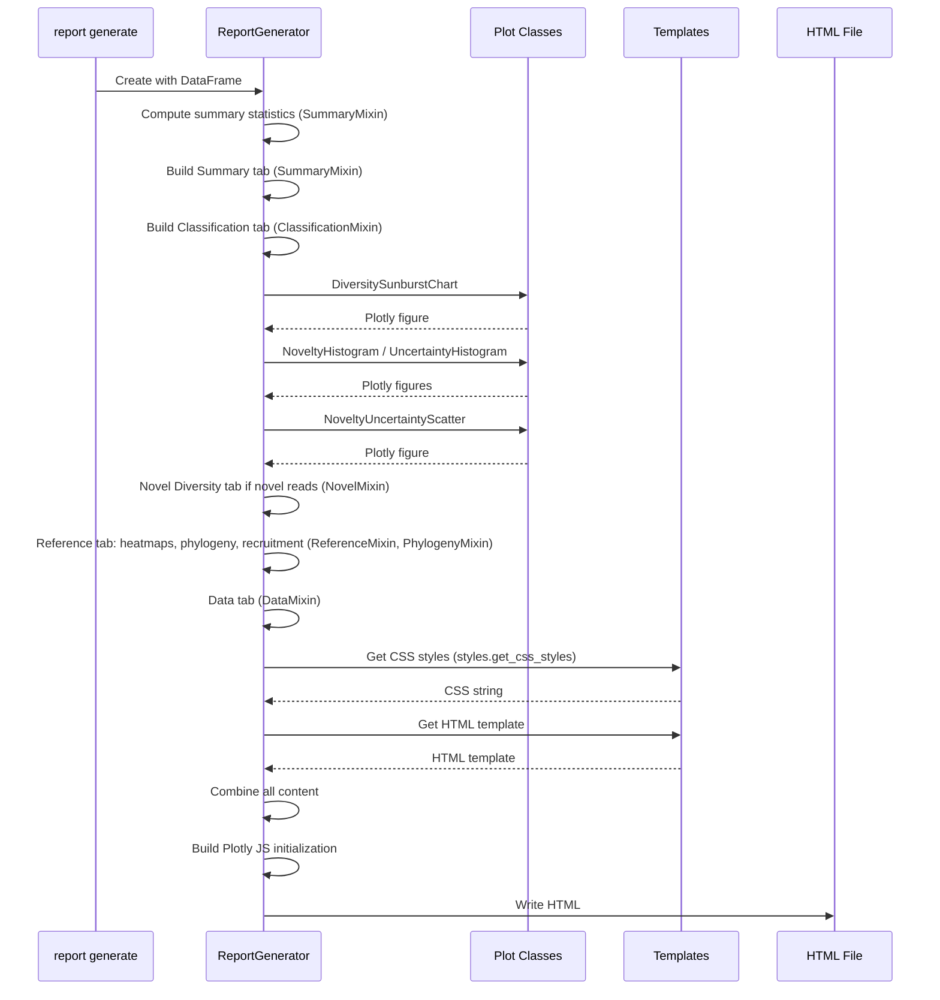
```mermaid
sequenceDiagram
    participant CLI as report generate
    participant Gen as ReportGenerator
    participant Plots as Plot Classes
    participant Template as Templates
    participant File as HTML File

    CLI->>Gen: Create with DataFrame
    Gen->>Gen: Compute summary statistics (SummaryMixin)

    Gen->>Gen: Build Summary tab (SummaryMixin)

    Gen->>Gen: Build Classification tab (ClassificationMixin)
    Gen->>Plots: DiversitySunburstChart
    Plots-->>Gen: Plotly figure
    Gen->>Plots: NoveltyHistogram / UncertaintyHistogram
    Plots-->>Gen: Plotly figures
    Gen->>Plots: NoveltyUncertaintyScatter
    Plots-->>Gen: Plotly figure

    Gen->>Gen: Novel Diversity tab if novel reads (NovelMixin)
    Gen->>Gen: Reference tab: heatmaps, phylogeny, recruitment (ReferenceMixin, PhylogenyMixin)
    Gen->>Gen: Data tab (DataMixin)

    Gen->>Template: Get CSS styles (styles.get_css_styles)
    Template-->>Gen: CSS string
    Gen->>Template: Get HTML template
    Template-->>Gen: HTML template

    Gen->>Gen: Combine all content
    Gen->>Gen: Build Plotly JS initialization

    Gen->>File: Write HTML
```

## Report Structure

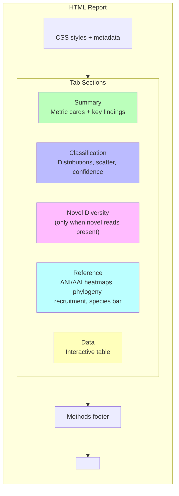
```mermaid
flowchart TB
    subgraph report["HTML Report"]
        direction TB

        HEAD["<head><br/>CSS styles + metadata"]

        subgraph tabs["Tab Sections"]
            direction LR
            OVERVIEW["Summary<br/>Metric cards + key findings"]
            DIST["Classification<br/>Distributions, scatter, confidence"]
            NOVEL["Novel Diversity<br/>(only when novel reads present)"]
            REFERENCE["Reference<br/>ANI/AAI heatmaps, phylogeny,<br/>recruitment, species bar"]
            DATA["Data<br/>Interactive table"]
        end

        METHODS["Methods footer"]
        SCRIPTS["<script><br/>Tab navigation + Plotly init"]
    end

    HEAD --> tabs
    tabs --> METHODS
    METHODS --> SCRIPTS

    style OVERVIEW fill:#bfb
    style DIST fill:#bbf
    style NOVEL fill:#fbf
    style REFERENCE fill:#bff
    style DATA fill:#ffb
```

## Multi-Sample Report Architecture

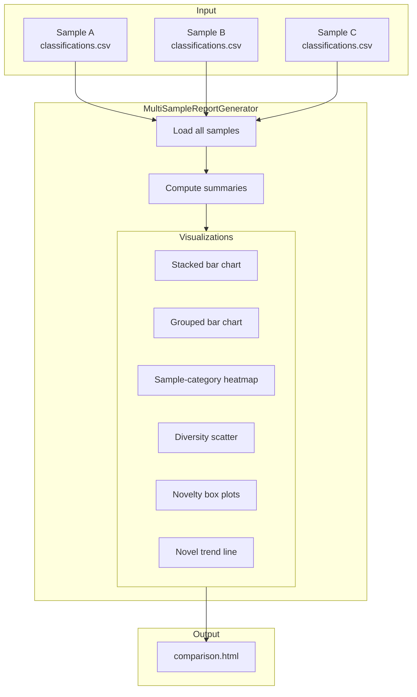
```mermaid
flowchart TB
    subgraph inputs["Input"]
        S1["Sample A<br/>classifications.csv"]
        S2["Sample B<br/>classifications.csv"]
        S3["Sample C<br/>classifications.csv"]
    end

    subgraph processing["MultiSampleReportGenerator"]
        LOAD["Load all samples"]
        COMPUTE["Compute summaries"]

        subgraph viz["Visualizations"]
            STACKED["Stacked bar chart"]
            GROUPED["Grouped bar chart"]
            HEATMAP["Sample-category heatmap"]
            SCATTER["Diversity scatter"]
            BOXPLOT["Novelty box plots"]
            TREND["Novel trend line"]
        end
    end

    subgraph output["Output"]
        HTML["comparison.html"]
    end

    S1 --> LOAD
    S2 --> LOAD
    S3 --> LOAD

    LOAD --> COMPUTE
    COMPUTE --> viz
    viz --> HTML
```

## Extended Classification Pipeline

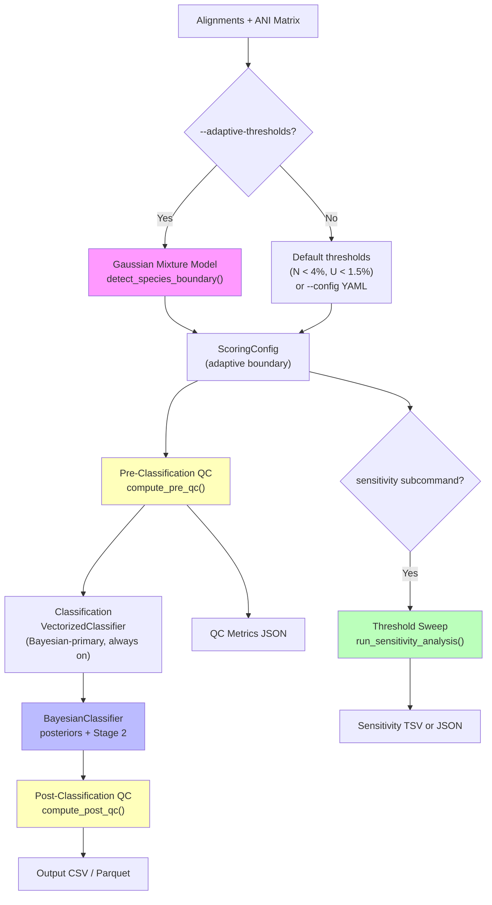
```mermaid
flowchart TD
    INPUT["Alignments + ANI Matrix"]

    INPUT --> ADAPTIVE{"--adaptive-thresholds?"}
    ADAPTIVE --> |Yes| GMM["Gaussian Mixture Model<br/>detect_species_boundary()"]
    ADAPTIVE --> |No| DEFAULT["Default thresholds<br/>(N < 4%, U < 1.5%)<br/>or --config YAML"]
    GMM --> CONFIG["ScoringConfig<br/>(adaptive boundary)"]
    DEFAULT --> CONFIG

    CONFIG --> PRE_QC["Pre-Classification QC<br/>compute_pre_qc()"]
    PRE_QC --> CLASSIFY["Classification<br/>VectorizedClassifier<br/>(Bayesian-primary, always on)"]
    CLASSIFY --> BAYES["BayesianClassifier<br/>posteriors + Stage 2"]
    BAYES --> POST_QC["Post-Classification QC<br/>compute_post_qc()"]
    POST_QC --> OUT["Output CSV / Parquet"]

    CONFIG --> SENSITIVITY{"sensitivity subcommand?"}
    SENSITIVITY --> |Yes| SWEEP["Threshold Sweep<br/>run_sensitivity_analysis()"]
    SWEEP --> SENS_OUT["Sensitivity TSV or JSON"]

    PRE_QC --> QC_OUT["QC Metrics JSON"]

    style GMM fill:#f9f
    style BAYES fill:#bbf
    style SWEEP fill:#bfb
    style PRE_QC fill:#ffb
    style POST_QC fill:#ffb
```

## Classification Module Dependencies

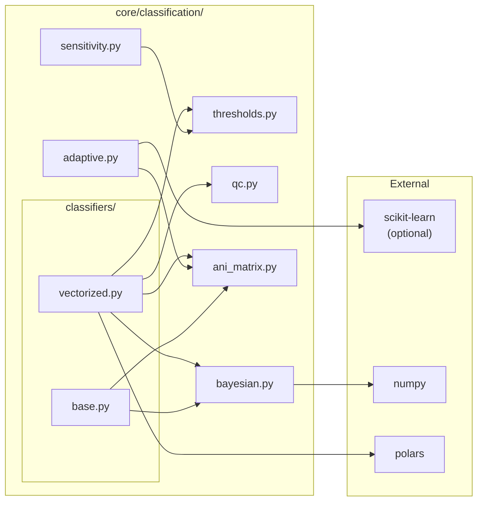
```mermaid
flowchart LR
    subgraph "core/classification/"
        THRESH["thresholds.py"]
        QC["qc.py"]
        SENS["sensitivity.py"]
        ADAPT["adaptive.py"]
        BAYES["bayesian.py"]
        ANI_MAT["ani_matrix.py"]

        subgraph classifiers["classifiers/"]
            BASE["base.py"]
            VEC["vectorized.py"]
        end
    end

    subgraph external["External"]
        SKLEARN["scikit-learn<br/>(optional)"]
        NUMPY["numpy"]
        POLARS["polars"]
    end

    VEC --> THRESH
    VEC --> QC
    VEC --> BAYES
    VEC --> ANI_MAT
    BASE --> BAYES
    SENS --> THRESH
    ADAPT --> ANI_MAT
    ADAPT --> SKLEARN
    BAYES --> NUMPY
    VEC --> POLARS
    BASE --> ANI_MAT
```

## CLI Command Structure (Updated)

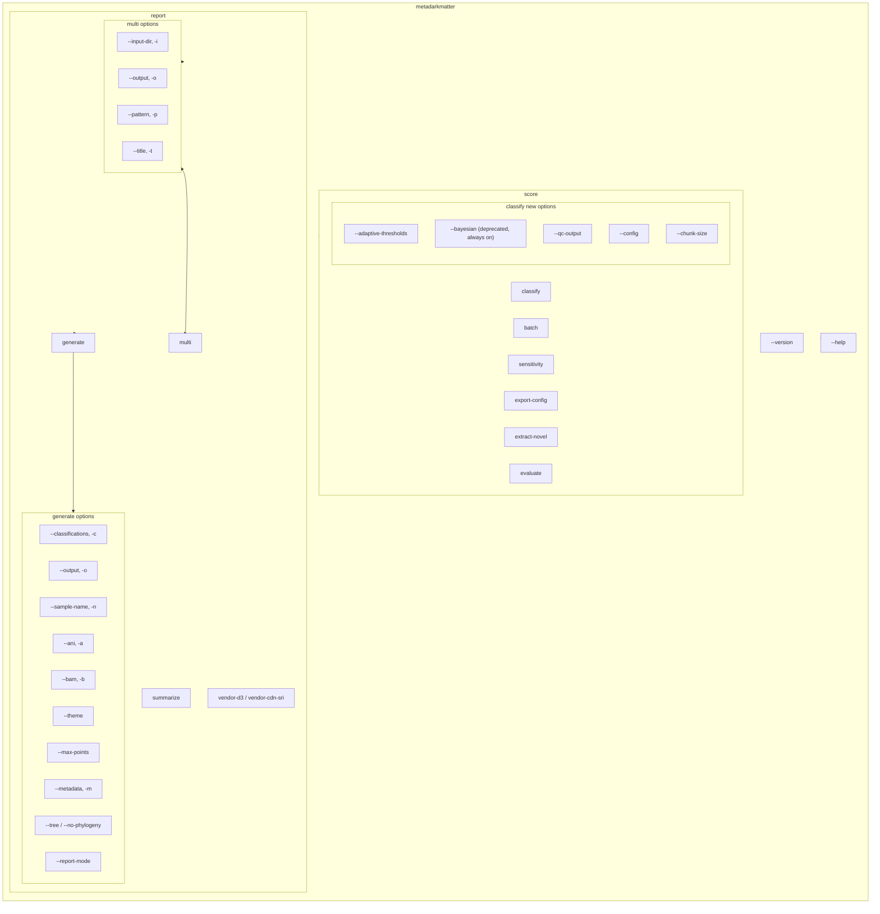
```mermaid
flowchart TB
    subgraph app["metadarkmatter"]
        VERSION["--version"]
        HELP["--help"]

        subgraph score["score"]
            CLASSIFY["classify"]
            BATCH["batch"]
            SENSITIVITY["sensitivity"]

            EXPORT["export-config"]
            EXTRACT["extract-novel"]
            EVALUATE["evaluate"]

            subgraph classify_new_opts["classify new options"]
                ADAPTIVE_OPT["--adaptive-thresholds"]
                BAYESIAN_OPT["--bayesian (deprecated, always on)"]
                QC_OPT["--qc-output"]
                CONFIG_OPT["--config"]
                CHUNK_OPT["--chunk-size"]
            end
        end

        subgraph report["report"]
            GENERATE["generate"]
            MULTI["multi"]
            SUMMARIZE["summarize"]
            VENDOR["vendor-d3 / vendor-cdn-sri"]

            subgraph gen_opts["generate options"]
                CLASS_OPT["--classifications, -c"]
                OUT_OPT["--output, -o"]
                NAME_OPT["--sample-name, -n"]
                ANI_OPT["--ani, -a"]
                BAM_OPT["--bam, -b"]
                THEME_OPT["--theme"]
                MAX_PTS["--max-points"]
                META_OPT["--metadata, -m"]
                TREE_OPT["--tree / --no-phylogeny"]
                MODE_OPT["--report-mode"]
            end

            subgraph multi_opts["multi options"]
                INDIR_OPT["--input-dir, -i"]
                OUTM_OPT["--output, -o"]
                PATTERN_OPT["--pattern, -p"]
                TITLE_OPT["--title, -t"]
            end
        end
    end

    app --> VERSION
    app --> HELP
    app --> score
    app --> report
    report --> GENERATE
    report --> MULTI
    GENERATE --> gen_opts
    MULTI --> multi_opts
```

## Theme System

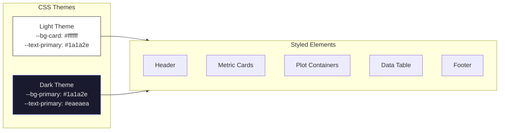
```mermaid
flowchart LR
    subgraph themes["CSS Themes"]
        LIGHT["Light Theme<br/>--bg-card: #ffffff<br/>--text-primary: #1a1a2e"]
        DARK["Dark Theme<br/>--bg-primary: #1a1a2e<br/>--text-primary: #eaeaea"]
    end

    subgraph elements["Styled Elements"]
        HEADER["Header"]
        CARDS["Metric Cards"]
        PLOTS["Plot Containers"]
        TABLE["Data Table"]
        FOOTER["Footer"]
    end

    LIGHT --> elements
    DARK --> elements

    style LIGHT fill:#fff,stroke:#333
    style DARK fill:#1a1a2e,stroke:#667eea,color:#eaeaea
```

## Plot Color Palette

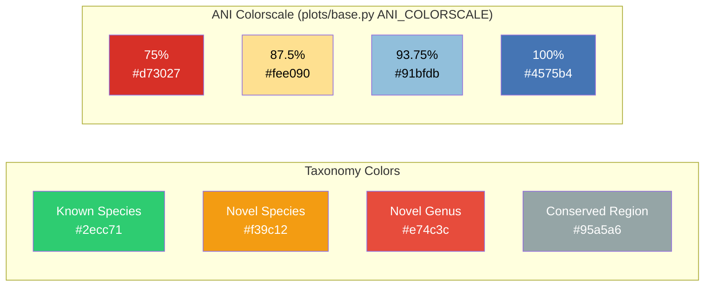
```mermaid
flowchart LR
    subgraph taxonomy["Taxonomy Colors"]
        KNOWN["Known Species<br/>#2ecc71"]
        NOVEL_SP["Novel Species<br/>#f39c12"]
        NOVEL_GEN["Novel Genus<br/>#e74c3c"]
        CONSERVED["Conserved Region<br/>#95a5a6"]
    end

    subgraph ani["ANI Colorscale (plots/base.py ANI_COLORSCALE)"]
        ANI75["75%<br/>#d73027"]
        ANI85["87.5%<br/>#fee090"]
        ANI95["93.75%<br/>#91bfdb"]
        ANI100["100%<br/>#4575b4"]
    end

    style KNOWN fill:#2ecc71,color:#fff
    style NOVEL_SP fill:#f39c12,color:#fff
    style NOVEL_GEN fill:#e74c3c,color:#fff
    style CONSERVED fill:#95a5a6,color:#fff
    style ANI75 fill:#d73027,color:#fff
    style ANI85 fill:#fee090,color:#000
    style ANI95 fill:#91bfdb,color:#000
    style ANI100 fill:#4575b4,color:#fff
```
